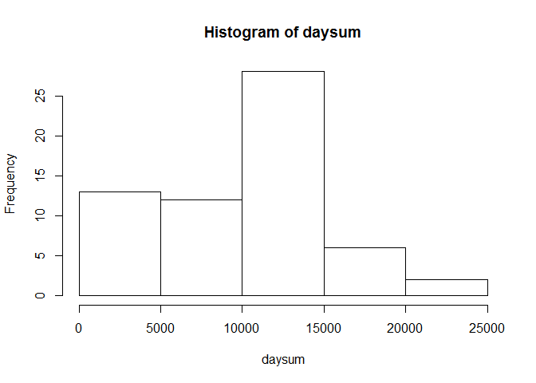
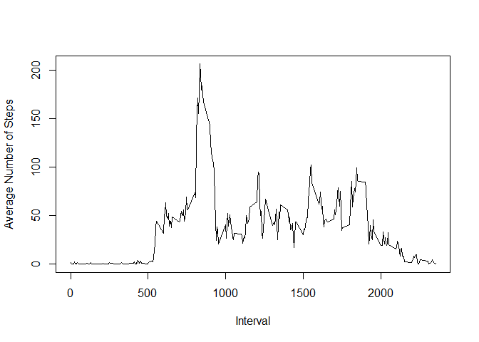
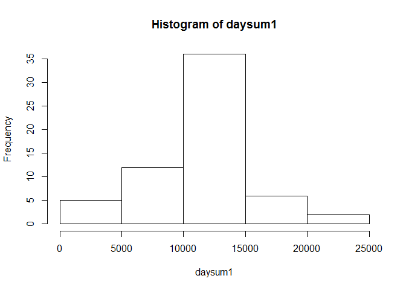
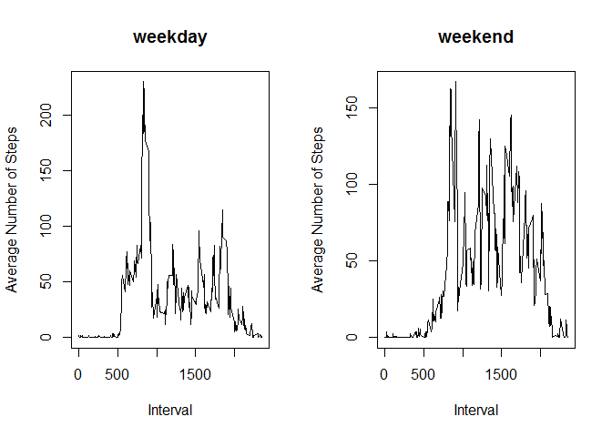

# Reproducible Research: Peer Assessment 1

## Loading and preprocessing the data

Firstly, data are loaded from the working directory.


```r
data <- read.csv("activity.csv")
```
The data do not need to be processed further.

## What is mean total number of steps taken per day?

A histogram of the total number of steps taken each day is as follows:


```r
daysum <- with(data,tapply(steps,date,sum,na.rm=TRUE))
hist(daysum)
```

 
   
The mean total number of steps taken per day:

```r
mean(daysum)
```

```
## [1] 9354.23
```

The median total number of steps taken per day:

```r
median(daysum)
```

```
## [1] 10395
```

  
## What is the average daily activity pattern?

Time series of the 5-minute interval (x-axis) and the average number of steps 
taken, averaged across all days (y-axis):


```r
int.ave <- with(data, aggregate(steps, list(interval=interval), mean,
                                     na.rm = TRUE
                                     )
                     )
with(int.ave, plot(interval, x, type="l", xlab="Interval", 
                        ylab="Average Number of Steps"
                        )
     )
```

 

The 5-minute interval which contains the maximum average number of steps across 
all the days in the dataset


```r
int.ave.max <- subset(int.ave, x == max(x))
int.ave.max$interval
```

```
## [1] 835
```
  
## Imputing missing values

The total number of missing values in the dataset is

```r
sum(is.na(data))
```

```
## [1] 2304
```

A way to handle the missing values is to replace a missing value at an interval 
with the mean of that interval. 


```r
data1 <- data  #duplicate dataset 
for (i in 1:length(data1$steps)){
        if (is.na(data1$steps[i])) {
                ave <- int.ave[int.ave$interval == data1$interval[i],]$x
                data1$steps[i] <- ave
        }
}
```

A histogram of the total number of steps taken each day is as follows:


```r
daysum1 <- with(data1,tapply(steps,date,sum))
hist(daysum1)
```

 
   
The mean total number of steps taken per day:

```r
mean(daysum1)
```

```
## [1] 10766.19
```

The median total number of steps taken per day:

```r
median(daysum1)
```

```
## [1] 10766.19
```

The mean and the median in this part is higher in those in the second part of
this report. This is because the inputting missing data has reduced the total
number of steps each day. By filling up the missing data, the data which was
previously ignored by now has a nonnegative value assigned to it. 
  
## Are there differences in activity patterns between weekdays and weekends?

Firstly, we create a new factor variable in the dataset with two levels - 
"weekday" and "weekend" indicating whether a given date is a weekday or weekend 
day. 


```r
data1$date <- as.Date(data1$date, format="%Y-%m-%d")
data1$weekend <- weekdays(data1$date) == "Saturday" | 
                 weekdays(data1$date) == "Sunday"
data1$weekend <- factor(data1$weekend, labels = c("weekday", "weekend"))
```

Below is a panel plot containing a time series plot of the 5-minute interval 
(x-axis) and the average number of steps taken, averaged across all weekday days
or weekend days (y-axis).


```r
int.ave.wday <- with(data1[data1$weekend=="weekday",], 
                     aggregate(steps, list(interval=interval), mean)
                     )
int.ave.wend <- with(data1[data1$weekend=="weekend",], 
                     aggregate(steps, list(interval=interval), mean)
                     )
par(mfrow = c(1,2))
with(int.ave.wday, plot(interval, x, type="l", xlab="Interval", 
                        ylab="Average Number of Steps", main="weekday"
                        )
     )
with(int.ave.wend, plot(interval, x, type="l", xlab="Interval", 
                        ylab="Average Number of Steps", main="weekend"
                        )
     )
```

 
  
Note that there are different patterns in the activity in weekdays and weekends.
